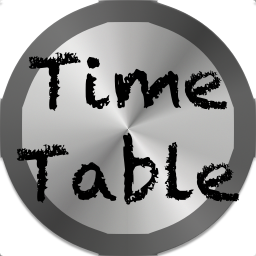

<p align="center">
  
</p>
# Electron Timetable []()[](https://www.versioneye.com/user/projects/57555eb37757a0003bd4b14f)[](https://github.com/willyb321/electron-menubar-timetable/releases/latest)[](https://github.com/willyb321/electron-menubar-timetable/stargazers)[](https://github.com/willyb321/electron-menubar-timetable/releases/latest)[]()[]()[](https://timetable-menubar.xyz)[](https://twitter.com/intent/tweet?text=Wow: https://github.com/willyb321/electron-menubar-timetable)
TimeTable in the menubar using electron. I have a [website](http://bit.ly/1XXz4iH) for this project.
***  
## [View the website](http://bit.ly/1XXz4iH)  

***  

## How to use? (Easy way)  

1. Download the latest release, unzip and then run timetable.app.  
2. Select your timetable images in the dialog that comes up.  

***  

## How to use? (Hard way)  
2. Clone the repo.  
3. ```$ cd electron-menubar-timetable```  
4. ```$ npm install```  
5. ```$ npm run build```  
6. Run the newly created application.  
7. Select your timetable images in the dialog that comes up.  
8. ???  
9. Profit.  

***  
At the moment, only OS X is supported, because Windows/Linux doesn't have a menubar.  

***  

## Changelog  
See [CHANGELOG.md](https://github.com/willyb321/electron-menubar-timetable/blob/master/CHANGELOG.md) for the changes happening.  

# Credits
<https://github.com/maxogden/menubar> - used for menubar  
<https://electron.atom.io> - for the main thing

# See some of my other projects:
[My GitHub profile](https://github.com/willyb321)  
[NPM Cards](https://github.com/willyb321/npm_cards)  

***
# Example


